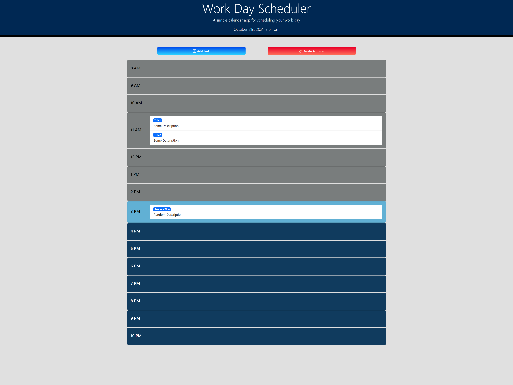

# WORK DAY SCHEDULER

## CONTENTS OF THIS FILE

* [Introduction](#introduction)
* [How to Use](#how-to-use)
* [Access](#access)
* [Contribution](#contribution)

## INTRODUCTION

A simple calendar application that allows a user to save events for each hour of the day. 
 
Built With:
- HTML
- CSS
- JavaScript
- Bootstrap
- jQuery

## HOW TO USE

- Go to the [webpage](https://paperpatch.github.io/schedule_workday/)
- Add tasks to your schedule. Each task is `draggable`. You can drag each task. Each time block can hold multiple tasks.
- Each tasks is `droppable`. Clicking and holding the task will make the trash chute appear on the bottom. Drop the task in the trash will delete it. 
- Be sure to clear your local storage key `[tasks]` in case it overlaps with another key. (Go to your webpage developer tools, `For Chrome Use F12`, and navigate to Developer Tools --> Application --> Storage --> Local Storage )

 

## ACCESS
[Webpage link](https://paperpatch.github.io/schedule_workday/)

## CONTRIBUTION
Made by Patrick Chen
